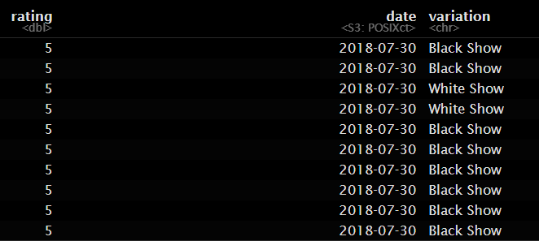

```{r setup, include=FALSE}
knitr::opts_chunk$set(echo = TRUE)
```
1. Using the for loop, create an R script that will display a 5x5 matrix as shown in
Figure 1. It must contain vectorA = [1,2,3,4,5] and a 5 x 5 zero matrix.
```{r}
vectorA <- c(1, 2, 3, 4, 5)
matrix5x5 <- matrix(0, nrow = 5, ncol = 5)

for (i in 1:5) {
  for (j in 1:5) {
    matrix5x5[i, j] <- vectorA[abs(i - j) + 1] - 1
  }
}
matrix5x5

```
2. Print the string "*" using for() function. The output should be the same as shown
in Figure
```{r}
for (i in 1:5) {
  for (j in 1:i) {
    cat("* ")
  }
  cat("\n")
}
```
3. Get an input from the user to print the Fibonacci sequence starting from the 1st input
up to 500. Use repeat and break statements. Write the R Scripts and its output.
```{r}
start <- as.integer(readline(prompt = "Enter the starting number:"))
start <- 5
a <- 0
b <- 1
cat("Fibonacci sequence starting from", start, "and up to 500:\n")
repeat {
  fib <- a + b
  if (fib > 500) break
  if (fib >= start) cat(fib, " ")
  a <- b
  b <- fib
}

cat("\n")

```
4. Import the dataset as shown in Figure 1 you have created previously.
```{r}
#4A.What is the R script for importing an excel or a csv file? Display the first 6 rows of the dataset? Show your codes and its result
shoe_data <- read.csv("shoesize_data.csv")
head(shoe_data)
```
```{r}
#4B. Create a subset for gender(female and male). How many observations are there inMale? How about in Female? Write the R scripts and its output.
male <- subset(shoe_data, Gender == "M")
male
female <- subset(shoe_data, Gender == "F")
female
```
```{r}
#4C. Create a graph for the number of males and females for Household Data. Use plot(),chart type = barplot. Make sure to place title, legends, and colors. Write the R scripts and its result.
#C. Barplot for genders
gender <- table(shoe_data$Gender)

barplot(gender,
        main = "Number of Males and Females",
        xlab = "Gender",
        ylab = "Count",
        col = c("Pink", "Blue"),
        names.arg = c("Female", "Male"),
        legend = rownames(gender))
```
5. The monthly income of Dela Cruz family was spent on the following:
```{r}
#5A. Create a piechart that will include labels in percentage.Add some colors and title of the chart. Write the R scripts and show its output.
expenses <- c(Food = 60, Electricity = 10, Savings = 5, Miscellaneous = 25)
percentages <- round(expenses / sum(expenses) * 100)
pie(expenses,
    labels = paste(names(expenses), percentages, "%"),
    col =  c("blue", "yellow", "pink", "purple"),
    main = "Dela Cruz Family Monthly Expenses")
```
6. Use the iris dataset.
```{r}
data(iris)
```
```{r}
#6A. Check for the structure of the dataset using the str() function. Describe what you have seen in the output.
str(iris)
# The data set provided information about the width and length of both sepals and petals, the species three levels was also  presented namely setosa,versicolor, and virginica.
```
```{r}
#6B. Create an R object that will contain the mean of the sepal.length,sepal.width,petal.length,and petal.width. What is the R script and its result?
mean <- colMeans(iris[, 1:4])
mean
```
```{r}
#6C. Create a pie chart for the Species distribution. Add title, legends, and colors. Write the R script and its result.
species <- table(iris$Species)
colors <- c("blue", "green", "pink")
pie(species,
    main = " Iris Species Distribution ",
    col = colors,
    labels = names(species))

legend("bottomleft", legend = names(species), fill = colors)
```
```{r}
#6D. Subset the species into setosa, versicolor, and virginica. Write the R scripts and show the last six (6) rows of each species.
setosa <- subset(iris, Species == "setosa")
versicolor <- subset(iris, Species == "versicolor")
virginica <- subset(iris, Species == "virginica")
tail(setosa)
tail(versicolor)
tail(virginica)
```
```{r}
#4E. Create a scatterplot of the sepal.length and sepal.width using the differentspecies(setosa,versicolor,virginica). Add a title = “Iris Dataset”, subtitle = “Sepal width and length, labels for the x and y axis, the pch symbol and colors should be based on the species.
species_colors <- c("setosa" = "red", "versicolor" = "blue", "virginica" = "green")
species_pch <- c("setosa" = 16, "versicolor" = 17, "virginica" = 18)
plot(iris$Sepal.Length, iris$Sepal.Width,
     main = "Iris Dataset",
     sub = "Sepal width and length",
     xlab = "Sepal Length",
     ylab = "Sepal Width",
     col = species_colors[iris$Species],
     pch = species_pch[iris$Species])

legend("topright", legend = names(species_colors), 
       col = species_colors, 
       pch = species_pch,
       title = "Species")

```
6F. Interpret the result.

Setosa: This flower type stands out clearly. Its points are clustered in a single area with shorter yet , wider sepals than the others. This means that Setosa has more compact sepals, making it easy to tell apart from the others

Versicolor: Versicolor’s points are more spread out and overlap a bit with Virginica’s, meaning it shares similar sepal sizes with Virginica. Its sepals are generally longer than Setosa’s but still vary in width.

Virginica: Virginica has the longest sepals overall, and it also has some overlap with Versicolor. This makes it a bit harder to distinguish from Versicolor based on these measurements alone.

7. Import the alexa-file.xlsx. Check on the variations. Notice that there are ex-
tra whitespaces among black variants (Black Dot, Black Plus, Black Show, Black Spot). Also on the white variants (White Dot, White Plus, White Show, White
Spot).
```{r}
library(readxl)
alexa <- read_excel("alexa_file.xlsx")
alexa
#7A. Rename the white and black variants by using gsub() function.
alexa$variation <- gsub("Black  Dot", "BlackDot", alexa$variation)
alexa$variation <- gsub("Black  Plus", "BlackPlus", alexa$variation)
alexa$variation <- gsub("Black  Show", "BlackShow", alexa$variation)
alexa$variation <- gsub("Black  Spot", "BlackSpot", alexa$variation)
alexa$variation <- gsub("White  Spot", "WhiteSpot", alexa$variation)
alexa$variation <- gsub("White  Show", "WhiteShow", alexa$variation)
alexa$variation <- gsub("White  Plus", "WhitePlus", alexa$variation)
alexa$variation <- gsub("White  Dot", "WhiteDot", alexa$variation)
alexa[1520:2000, ]
```
Write the R scripts and show an example of the output by getting a snippet. To embed
an image into Rmd, use the function below:
```{r}
library(knitr)


```

7B. Get the total number of each variations and save it into another object. Save the
object as variations.RData. Write the R scripts. What is its result?
Hint: Use the dplyr package. Make sure to install it before loading the package.
```{r}
library(dplyr)
alexa_var <- alexa %>%
  count(alexa$variation)
save(alexa_var, file = "variations.RData")
alexa_var
```
7C.From the variations.RData, create a barplot(). Complete the details of the chart
which include the title, color, labels of each bar.
```{r}
load("variations.RData")
var_bar <- barplot(
  alexa_var$n,                              
  names.arg = alexa_var$`alexa$variation`,        
  col = cm.colors(length(alexa_var$n)),  
  main = "Total Number of Variations", 
  las = 2,
)
```
7D.Create a barplot() for the black and white variations. Plot it in 1 frame, side by
side. Complete the details of the chart.
```{r}
load("variations.RData")
par(mfrow = c(1, 2))

black <- alexa_var %>% 
  filter(`alexa$variation` %in% c("Black", "BlackDot", "BlackPlus", "BlackShow", "BlackSpot"))

barplot(
  height = black$n, 
  names.arg = black$`alexa$variation`, 
  col = topo.colors(length(black$n)),               
  main = "Black Variants",
  las = 2
)

white <- alexa_var %>% 
  filter(`alexa$variation` %in% c("White", "WhiteDot", "WhitePlus", "WhiteShow", "WhiteSpot"))

barplot(
  height = white$n,  
  names.arg = white$`alexa$variation`, 
  col = terrain.colors(length(white$n)),              
  main = "White Variants",,
  las = 2
)

```


